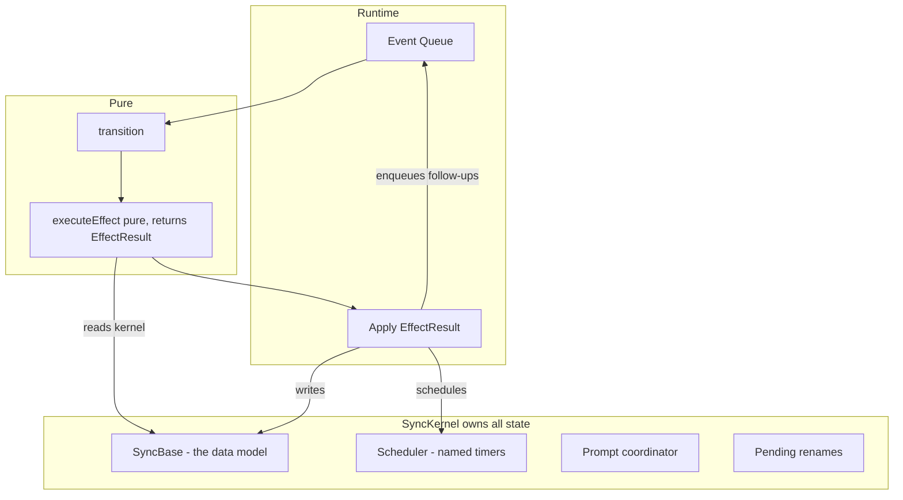

# Code Link Sync Refactor

The refactor is four concrete changes plus several follow-on cleanup steps, each independently mergeable behind the existing test suite. No UX change, no CLI flag change. Protocol changes are allowed if they're worth it: they must materially simplify the state model, remove duplicated state/logic, or make transitions more explicit. `transition()` stays bit-for-bit identical. The plugin's `SocketConnectionController` stays untouched.

## The thesis in one line

Every mutation goes through a named kernel method. Every echo/conflict question becomes a lookup against one data model. Every effect is a pure function describing what should change. Every timer has a name.

## Protocol changes

Wire changes are allowed when they earn their keep. "Worth it" means the protocol change removes duplicated state, makes sync phase ownership explicit, or simplifies reasoning enough to pay for the extra churn. If a step changes the protocol, update both CLI and plugin in the same branch, document why in the PR, and add or update tests for the changed flow. Mixed old/new branch compatibility is nice-to-have, not required for this refactor.

## Why this layout is AI-traceable

A reviewer or AI asking "is change X safe?" walks exactly three paths:

1. The `transition()` case arm for the event — pure, local, already correct.
2. The `EffectResult` returned by each effect — pure input to output, visible in one function.
3. The `SyncBase` invariant: "base holds what the other side thinks we have; any event matching base is an echo."

No shared closure state. No cross-effect mutation. No timers hidden in the hot path.

## Architecture after the refactor




## Existing test coverage

The repo has 3,082 lines of tests. Most lock in behavior we must preserve. Two files are heavily mock-based and will be **rewritten** in Step 6, not preserved:

**Keep as-is (~2,537 lines) — these test real behavior at real boundaries:**

- `[controller.test.ts](packages/code-link-cli/src/controller.test.ts)` (626 lines) — `transition()` across all modes, already pure
- `[helpers/watcher.test.ts](packages/code-link-cli/src/helpers/watcher.test.ts)` (668 lines) — chokidar rename coalescing, sanitization echo, buffer edge cases
- `[helpers/connection.test.ts](packages/code-link-cli/src/helpers/connection.test.ts)` (175 lines)
- `[helpers/files.test.ts](packages/code-link-cli/src/helpers/files.test.ts)` (398 lines) — `filterEchoedFiles`, `detectConflicts`, drift window
- `[plugins/code-link/src/api.test.ts](plugins/code-link/src/api.test.ts)` (536 lines) — `withExpectedSnapshotPatch` rollback; mocks are at the Framer SDK boundary, legitimate
- `[plugins/code-link/src/utils/sockets.test.ts](plugins/code-link/src/utils/sockets.test.ts)` (134 lines) — mocks `WebSocket` which is an external boundary, legitimate

**Rewrite in Step 6 (~545 lines) — mock-heavy internal tests:**

- `[controller.rename.test.ts](packages/code-link-cli/src/controller.rename.test.ts)` (418 lines, **71 `vi.fn/mock` calls, 23 `as never` casts**) — stubs `hashTracker`, `fileMetadataCache`, `userActions`, even `syncState.socket` because `executeEffect` receives mutable context. These stub-and-assert patterns exist *because* effects aren't pure — `EffectResult` makes them obsolete.
- `[controller.once.test.ts](packages/code-link-cli/src/controller.once.test.ts)` (127 lines, 20 mocks, 6 `as never` casts) — same pattern.

The refactor preserves all 2,537 legitimate lines. The 545 mock-heavy lines become ~200 lines of `EffectResult` value-equality assertions. Step 1 below only adds tests for the gap nothing covers: end-to-end flow through `start()`.

## The four changes

### 1. `SyncKernel` — concentrates the 11 mutable stores

New file `[packages/code-link-cli/src/kernel.ts](packages/code-link-cli/src/kernel.ts)`. Owns every piece of mutable sync state. Exposes narrow named methods instead of raw maps.

Replaces direct access to:

- `[utils/hash-tracker.ts](packages/code-link-cli/src/utils/hash-tracker.ts)`
- `[utils/file-metadata-cache.ts](packages/code-link-cli/src/utils/file-metadata-cache.ts)`
- `pendingRenameConfirmations` Map (currently local to `start()` in `[controller.ts:1110](packages/code-link-cli/src/controller.ts)`)
- `[helpers/plugin-prompts.ts](packages/code-link-cli/src/helpers/plugin-prompts.ts)` `PluginUserPromptCoordinator`
- Installer reference, shutdown flag
- Module-level state in `[utils/logging.ts](packages/code-link-cli/src/utils/logging.ts)` (`disconnectTimer`, `hadRecentDisconnect`, `isShowingDisconnect`)

Illustrative shape (exact method set determined during implementation):

```ts
interface SyncKernel {
  base: SyncBase
  scheduler: Scheduler
  recordLocalSend(path: string, hash: string): void
  recordRemoteApplied(path: string, hash: string, modifiedAt: number): void
  recordDelete(path: string): void
  registerPendingRename(oldPath: string, newPath: string, content: string): void
  resolvePendingRename(newPath: string): PendingRename | undefined
  awaitUserPrompt(id: string): Promise<PromptResult>
  completeUserPrompt(id: string, result: PromptResult): void
  flush(): Promise<void>
}
```

### 2. `SyncBase` — the formal data model for echo and conflict

The conceptual third tree, implemented as one owned structure inside the kernel. Not a new persisted file — it subsumes `[fileMetadataCache](packages/code-link-cli/src/utils/file-metadata-cache.ts)` which already holds most of this shape.

```ts
interface SyncBaseEntry {
  hash: string          // content hash we and the peer last agreed on
  modifiedAt: number    // when that agreement happened
  tombstone?: boolean   // the peer thinks this file is deleted
}

interface SyncBase {
  get(path: string): SyncBaseEntry | undefined
  isEcho(path: string, hash: string): boolean
  isDeleteEcho(path: string): boolean
  record(path: string, entry: SyncBaseEntry): void
  forget(path: string): void
  snapshot(): Map<string, SyncBaseEntry>
}
```

Every echo check in the codebase becomes `kernel.base.isEcho(path, hash)`. The three current systems collapse:

- `[utils/hash-tracker.ts](packages/code-link-cli/src/utils/hash-tracker.ts)` — deleted. Its `shouldSkip`, `shouldSkipDelete`, `markDelete`, `clearDelete`, `forget`, `remember` all become `SyncBase` operations.
- `contentHashCache` / `pendingDeletes` / `pendingAdds` / `recentSanitizations` in `[helpers/watcher.ts](packages/code-link-cli/src/helpers/watcher.ts)` — the buffers that exist for rename coalescing stay (they're data-structure, not echo). Echo suppression (`recentSanitizations`) becomes a base lookup.
- The 5s delete echo window becomes an explicit `tombstone: true` entry with a base-owned TTL, documented in one place.

Plugin side gets a parallel `PluginBase` in the kernel shape, replacing `[api.ts](plugins/code-link/src/api.ts)` `lastSnapshot` and `[packages/code-link-shared/src/sync-tracker.ts](packages/code-link-shared/src/sync-tracker.ts)`. Deleted: `sync-tracker.ts`.

Conflict detection (currently in `[helpers/files.ts](packages/code-link-cli/src/helpers/files.ts)` `detectConflicts`) reads from `base.snapshot()`. Same code, clearer source.

### 3. `EffectResult` — effects become pure

Effects stop receiving mutable context and calling methods imperatively. They receive read-only state and return a description of what should happen.

In `[controller.ts](packages/code-link-cli/src/controller.ts)`, replace:

```ts
async function executeEffect(effect: Effect, context: {
  config, hashTracker, installer, fileMetadataCache,
  pendingRenameConfirmations, shutdown, userActions, syncState
}): Promise<SyncEvent[]>
```

With:

```ts
type KernelOp =
  | { op: "recordLocalSend"; path: string; hash: string }
  | { op: "recordRemoteApplied"; path: string; hash: string; modifiedAt: number }
  | { op: "recordDelete"; path: string }
  | { op: "registerPendingRename"; oldPath: string; newPath: string; content: string }
  | { op: "completePendingRename"; newPath: string }
  | { op: "schedule"; name: ScheduledTask; delayMs: number }
  | { op: "cancel"; name: ScheduledTask }

interface EffectResult {
  followUps?: SyncEvent[]
  kernelOps?: KernelOp[]
  sends?: CliToPluginMessage[]
  writes?: FileWrite[]
  deletes?: string[]
  log?: { level: LogLevel; message: string }
}

async function executeEffect(
  effect: Effect,
  readOnly: { kernel: ReadonlyKernel; config: Config; syncState: SyncState }
): Promise<EffectResult>
```

The runtime (`processEvent` in `[controller.ts:1125](packages/code-link-cli/src/controller.ts)`) drains effects: execute → apply `kernelOps` atomically → perform `writes/deletes/sends` I/O → enqueue `followUps`. Between effects the kernel is always in a consistent state.

Conversion strategy: **compatibility shim**. Runtime accepts both old-style (mutates context, returns `SyncEvent[]`) and new-style (read-only, returns `EffectResult`) effects during the migration. Land one effect at a time. Shim deleted at end of Step 6. This keeps each PR small and bisectable.

**Test rewrite (part of Step 6):** as each effect converts, its tests in `[controller.rename.test.ts](packages/code-link-cli/src/controller.rename.test.ts)` and `[controller.once.test.ts](packages/code-link-cli/src/controller.once.test.ts)` get rewritten from mock-and-assert to value-equality:

```ts
// Before (current style): 30+ lines, 7 vi.fn stubs, 3 `as never` casts
const hashTracker = { remember: vi.fn(), shouldSkip: vi.fn(), ... }
await executeEffect(effect, { hashTracker: hashTracker as never, ... })
expect(hashTracker.remember).toHaveBeenCalledWith("Foo.tsx", content)

// After: 5 lines, zero mocks, zero casts
const result = await executeEffect(effect, { kernel: readOnly, config, syncState })
expect(result.kernelOps).toContainEqual({ op: "recordLocalSend", path: "Foo.tsx", hash: hashOf(content) })
expect(result.sends).toContainEqual({ type: "file-changed", fileName: "Foo.tsx", content })
```

Goal: both files contain zero `vi.mock`, zero `vi.fn`, zero `as never` by the end of Step 6. Every effect gets a test that reads as a spec. No context mocking — that anti-pattern only existed because `executeEffect` received a mutable context.

### 4. `Scheduler` — every timer has a name

New `Scheduler` inside the kernel. Replaces every `setTimeout` in the CLI with a named scheduled task. Current behaviors unchanged; durations centralized in a new `[packages/code-link-cli/src/timings.ts](packages/code-link-cli/src/timings.ts)` file with documented rationale.

```ts
type ScheduledTask =
  | "disconnectNotice"
  | "hiddenTabGrace"
  | "reconnectBackoff"
  | "wakeDebounce"
  | "connectTimeout"
  | "renameBuffer"
  | "sanitizationEchoExpiry"
  | "tombstoneExpiry"

interface Scheduler {
  after(name: ScheduledTask, delayMs: number, fn: () => void): void
  cancel(name: ScheduledTask): void
  cancelAll(): void
}

// timings.ts
export const TIMINGS = {
  disconnectNotice: 4_000,     // delay before showing "disconnected" in CLI status
  hiddenTabGrace: 5_000,       // plugin pauses reconnect after tab hidden this long
  reconnectBackoffBase: 500,   // plugin reconnect base delay
  reconnectBackoffMax: 5_000,  // plugin reconnect cap
  wakeDebounce: 300,           // plugin debounces focus/visibility wake
  connectTimeout: 1_500,       // plugin socket connect timeout
  renameBuffer: 100,           // watcher rename coalesce window
  sanitizationEchoExpiry: 300, // watcher suppress echo from path sanitization
  tombstoneExpiry: 5_000,      // SyncBase delete tombstone TTL (former hashTracker delete window)
} as const
```

A test-time `FakeScheduler` makes every timing-dependent behavior deterministic. Only touches CLI; plugin's existing socket timing (already solid) stays as-is.

## Sequencing — nine independently mergeable steps


| Step | Change                                                                                                                                                                                                                                                                                                                                             | Behavior change?                                            |
| ---- | -------------------------------------------------------------------------------------------------------------------------------------------------------------------------------------------------------------------------------------------------------------------------------------------------------------------------------------------------- | ----------------------------------------------------------- |
| 1    | Add targeted end-to-end tests that drive `start()` across component seams. See scope below.                                                                                                                                                                                                                                                        | No — tests only                                             |
| 2    | Introduce `Scheduler` + `[timings.ts](packages/code-link-cli/src/timings.ts)`. Replace every CLI `setTimeout` with named scheduler calls. Durations unchanged.                                                                                                                                                                                     | No                                                          |
| 3    | Introduce `SyncKernel`. Initially wraps existing `hashTracker`, `fileMetadataCache`, `pendingRenameConfirmations`, `userActions`. Effects receive kernel instead of raw maps.                                                                                                                                                                      | No                                                          |
| 4    | Introduce `SyncBase`. Collapse `hashTracker` and watcher echo buffers into `SyncBase` lookups. Delete `[utils/hash-tracker.ts](packages/code-link-cli/src/utils/hash-tracker.ts)`.                                                                                                                                                                 | No (tombstone replaces 5s window with equivalent semantics) |
| 5    | Plugin side: introduce `PluginBase`, collapse `[api.ts](plugins/code-link/src/api.ts)` `lastSnapshot` + `[sync-tracker.ts](packages/code-link-shared/src/sync-tracker.ts)` into it. Delete `sync-tracker.ts`. Port `withExpectedSnapshotPatch` rollback semantics into `PluginBase`.                                                                       | No user-visible change                                      |
| 6    | Convert effects to return `EffectResult` behind a compatibility shim (one effect per PR). Rewrite mock-heavy tests in `controller.rename.test.ts` / `controller.once.test.ts` as value-equality assertions. Delete shim when last effect converts. End state: zero `vi.mock` / `vi.fn` / `as never` in effect tests.                                       | No                                                          |
| 7    | Align plugin `Mode` with CLI `SyncMode` as a projection. Move `framer.showUI` / `hideUI` / `setBackgroundMessage` out of render switch in `[App.tsx:231](plugins/code-link/src/App.tsx)` into an effect handler on mode transitions. A wire message change is allowed here if it materially simplifies mode ownership.                                       | No user-visible change; protocol change allowed if worth it |
| 8    | Plugin-side clarity pass: replace `mode + syncMode + pendingDeletes + conflicts` precedence logic with an explicit discriminated-union UI state/reducer. Goal: a junior dev can read one reducer and answer "what screen is active?" and "what prompt is active?" without cross-file inference.                                                             | No user-visible change                                      |
| 9    | Optional hardening: add prompt/session ids to delete/conflict flows so reconnect safety is enforced by identity checks. CLI ignores stale ids; plugin clears or supersedes prompts by session. Do this only if the extra protocol surface still pays for itself after Step 8.                                                                              | No user-visible change; optional protocol change            |


Each step passes the existing 3,082-line test suite plus the new Step 1 tests. Deferred (per your call): the pure watcher rename helper extraction and the serial event queue.

## Junior-friendly follow-ons

Step 8 is about local clarity, not new behavior. Today the plugin UI state is spread across `mode`, `syncMode`, `pendingDeletes`, and `conflicts`, which forces readers to reconstruct precedence rules in their head. Replace that with one discriminated-union reducer state so prompt lifetime and background state are explicit.

Step 9 is optional. If Step 8 already makes reconnect behavior obvious enough, stop there. If not, add prompt/session ids so stale responses are impossible by construction rather than merely unlikely by flow control.

## Step 1 — narrow scope

The existing tests already cover everything component-local (rename buffering, echo filtering, conflict heuristics, plugin snapshot rollback, socket controller lifecycle). The **only** gap is **cross-component flow through `start()`**. Add one new file, `packages/code-link-cli/src/controller.integration.test.ts`, with these specific scenarios:

1. **Watcher fires during `snapshot_processing`** — handshake + `REMOTE_FILE_LIST` in flight when a local watcher event arrives. Verify it's queued into `pendingRemoteChanges` and applied after snapshot commits.
2. **Reconnect during `conflict_resolution`** — socket drops while user has pending conflict prompt; new handshake arrives. Verify prompt coordinator isn't left dangling and the new snapshot is re-reconciled correctly.
3. **Handshake replaces active socket** — second plugin client connects with same `projectId`. Verify old socket gets `CLOSE_CODE_REPLACED` and new one proceeds through full handshake.

Test scaffolding (keep minimal):

- **Socket fake**: tiny in-memory object implementing `send`, `close`, `readyState` — the only `ws.WebSocket` surface `helpers/connection.ts::sendMessage` uses. **Do not** rebuild the plugin's `SocketConnectionController`; it stays out of scope.
- **FS**: real `fs` in `os.tmpdir()` subdirs (pattern already used by `[controller.rename.test.ts](packages/code-link-cli/src/controller.rename.test.ts)`).
- **Watcher**: inject a fake implementing the `Watcher` interface at `[helpers/watcher.ts:16](packages/code-link-cli/src/helpers/watcher.ts)` so tests emit events deterministically without chokidar debounce timing. The real `initWatcher` stays covered by the existing 668-line `watcher.test.ts`.

That's it. If these three pass before and after each subsequent step, the refactor is safe.

## Explicit out-of-scope: do not modify

These are correct, well-tested, or unrelated. The refactor must not touch them. If a step seems to require changing one, stop and reconsider the approach.

**Plugin side:**

- `[plugins/code-link/src/utils/sockets.ts](plugins/code-link/src/utils/sockets.ts)` (390 lines, covered by `[sockets.test.ts](plugins/code-link/src/utils/sockets.test.ts)`) — `SocketConnectionController`, visibility/focus handling, `CLOSE_CODE_REPLACED`, connect-timeout graduation (1500ms → 3000ms), hidden-tab grace. Its three internal timers (`connectTrigger`, `connectTimeout`, `hiddenGrace`) already have names. **Step 2's `Scheduler` does not extend to the plugin.**
- `[plugins/code-link/src/main.tsx](plugins/code-link/src/main.tsx)`, `[App.css](plugins/code-link/src/App.css)`
- `[plugins/code-link/src/utils/clipboard.ts](plugins/code-link/src/utils/clipboard.ts)`, `[diffing.ts](plugins/code-link/src/utils/diffing.ts)`, `[logger.ts](plugins/code-link/src/utils/logger.ts)`, `[useConstant.ts](plugins/code-link/src/utils/useConstant.ts)`
- `[messages.ts](plugins/code-link/src/messages.ts)` — only touched by Step 5 (drop `sync-tracker` import) and Step 7 (mode projection). Other steps: leave alone.

**CLI side — protected logic within in-scope files:**

- `transition()` signature and every case arm in `[controller.ts](packages/code-link-cli/src/controller.ts)` — bit-for-bit unchanged. `SyncState` / `SyncEvent` / `Effect` type definitions unchanged.
- `detectConflicts`, `autoResolveConflicts`, drift windows, sanitization in `[helpers/files.ts](packages/code-link-cli/src/helpers/files.ts)` — unchanged; only the data source shifts from `fileMetadataCache` to `kernel.base.snapshot()`.
- `[helpers/git.ts](packages/code-link-cli/src/helpers/git.ts)`, `[helpers/skills.ts](packages/code-link-cli/src/helpers/skills.ts)`, `[helpers/certs.ts](packages/code-link-cli/src/helpers/certs.ts)`, `[helpers/installer.ts](packages/code-link-cli/src/helpers/installer.ts)` — external I/O boundaries, already correctly mocked. Do not touch.
- `[helpers/sync-validator.ts](packages/code-link-cli/src/helpers/sync-validator.ts)` — pure, stays pure; only its consumer changes.
- `[utils/state-persistence.ts](packages/code-link-cli/src/utils/state-persistence.ts)` — on-disk format unchanged.
- `[utils/imports.ts](packages/code-link-cli/src/utils/imports.ts)`, `[utils/node-paths.ts](packages/code-link-cli/src/utils/node-paths.ts)`, `[utils/project.ts](packages/code-link-cli/src/utils/project.ts)`
- `[types.ts](packages/code-link-cli/src/types.ts)`, `[index.ts](packages/code-link-cli/src/index.ts)` — public API unchanged.

**Shared:**

- `[packages/code-link-shared/src/types.ts](packages/code-link-shared/src/types.ts)` — canonical protocol surface. Message changes are allowed only when they materially reduce duplicated state/logic and are covered by tests.
- `[packages/code-link-shared/src/hash.ts](packages/code-link-shared/src/hash.ts)`, `[paths.ts](packages/code-link-shared/src/paths.ts)` — unchanged.

**Tests — protected (2,537 lines, do not rewrite):**

- `[controller.test.ts](packages/code-link-cli/src/controller.test.ts)`, `[helpers/watcher.test.ts](packages/code-link-cli/src/helpers/watcher.test.ts)`, `[helpers/connection.test.ts](packages/code-link-cli/src/helpers/connection.test.ts)`, `[helpers/files.test.ts](packages/code-link-cli/src/helpers/files.test.ts)`, `[plugins/code-link/src/api.test.ts](plugins/code-link/src/api.test.ts)`, `[plugins/code-link/src/utils/sockets.test.ts](plugins/code-link/src/utils/sockets.test.ts)`, `[helpers/skills.test.ts](packages/code-link-cli/src/helpers/skills.test.ts)`, `[helpers/certs.test.ts](packages/code-link-cli/src/helpers/certs.test.ts)`, `[helpers/installer.test.ts](packages/code-link-cli/src/helpers/installer.test.ts)`, `[utils/project.test.ts](packages/code-link-cli/src/utils/project.test.ts)`, and all `packages/code-link-shared/src/*.test.ts`.
- These must pass unchanged after every step. If one fails, the step is wrong — do not edit the test to make it pass.

## What stays exactly the same

- User-visible sync behavior: same conflict UX, same delete UX, same reconnect UX, same tab replacement UX
- Every conflict detection rule in `[helpers/files.ts](packages/code-link-cli/src/helpers/files.ts)`
- The 2000ms drift window in `autoResolveConflicts`
- The 5s delete echo behavior (now a named tombstone)
- On-disk format of persisted state in `[utils/state-persistence.ts](packages/code-link-cli/src/utils/state-persistence.ts)`
- Every CLI flag
- `transition()` signature and every case arm
- Public API: `start(config)` from `[controller.ts](packages/code-link-cli/src/controller.ts)`
- All UX: conflict modal, delete confirmation, reconnect behavior, tab replacement
- **The plugin's `[SocketConnectionController](plugins/code-link/src/utils/sockets.ts)`** — visibility/focus handling, `CLOSE_CODE_REPLACED`, connect-timeout graduation, hidden-tab grace. Zero changes; it's correct and hard-won.
- All 3,082 existing test lines keep passing unchanged.

## Risks and mitigations

- `**SyncBase` tombstone changes echo timing** — Step 1 test 1 plus the existing rapid-delete tests in `files.test.ts` cover this. Tombstone TTL matches current 5s `hashTracker` window. Centralized and documented.
- `**Protocol changes create mixed-version risk**` — acceptable when the simplification is worth it. Land CLI + plugin protocol updates together in the same branch/PR, document the rationale, and add/update tests for the new message flow. Backward compatibility with mixed old/new commits is optional, not required here.
- `**Plugin reconnect/prompt state is still hard to read**` — Step 8 removes implicit precedence rules by making UI state a discriminated union. If reconnect safety still depends on "knowing the flow," Step 9 adds prompt/session identity and turns it into an equality check.
- `**EffectResult` conversion is a large diff** — land one effect at a time behind a compatibility shim that accepts both old-style (mutates kernel) and new-style (returns result). Remove shim at the end.
- `**PluginBase` drops `withExpectedSnapshotPatch` transactional rollback** — port rollback semantics into `PluginBase.apply`; `[api.test.ts](plugins/code-link/src/api.test.ts)` (536 lines) covers this.
- **Logging module state migration** — `[utils/logging.ts](packages/code-link-cli/src/utils/logging.ts)` `disconnectTimer` / `hadRecentDisconnect` / `isShowingDisconnect` fold into kernel during Step 2 via the scheduler, or during Step 3 if easier. Small, isolated.

## Review ergonomics after landing

A reviewer or AI answering "is X safe?" reads three files in order:

1. The `transition()` case arm in `[controller.ts](packages/code-link-cli/src/controller.ts)` — pure, local.
2. The `executeEffect` case — pure function, inputs visible, `EffectResult` visible.
3. The `SyncBase` or `Scheduler` method the effect's `kernelOps` reference — named, under 20 lines.

No closure state to trace. No cross-effect mutation to consider. No timers to reason about without a name. The answer is local.

## Test ergonomics after landing

Mocks exist only at real external boundaries: Framer SDK (`[api.test.ts](plugins/code-link/src/api.test.ts)`), `WebSocket` (`[sockets.test.ts](plugins/code-link/src/utils/sockets.test.ts)`), `fs`/`crypto` where unavoidable (`[certs.test.ts](packages/code-link-cli/src/helpers/certs.test.ts)`, `[installer.test.ts](packages/code-link-cli/src/helpers/installer.test.ts)`). Internal tests for effects are pure value-equality:

- Adding a new effect means adding one case to `executeEffect`, one test that passes an `Effect` and asserts on `EffectResult`. No mock setup. No `as never`.
- When a reviewer asks "does this effect do the right thing?", the test reads like a spec: given this effect, produce exactly this `EffectResult`.
- Zero `vi.mock` in the three internal test files (`controller.test.ts`, `controller.rename.test.ts`, `controller.once.test.ts`) after Step 6.

