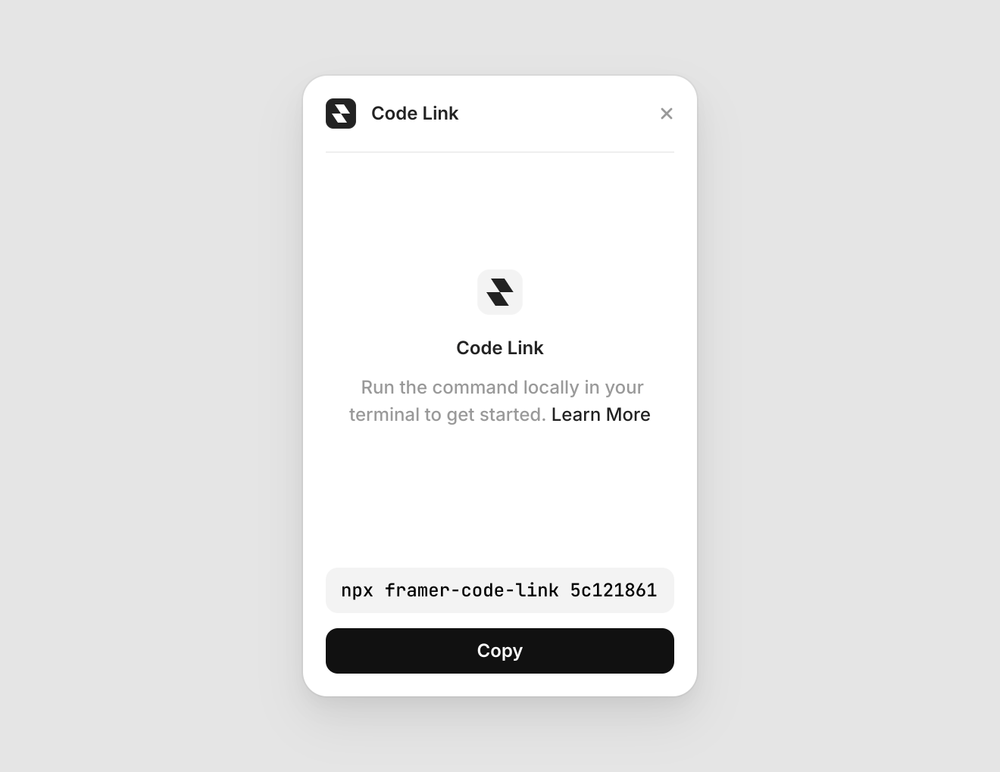

# Framer Code Link

Plugin that syncs code files between Framer and your local filesystem via the Code Link CLI.

**By:** @huntercaron

## Usage

1. Open the Plugin in Framer
2. Copy the CLI command shown in the Plugin
3. Run the command in your terminal to start syncing
