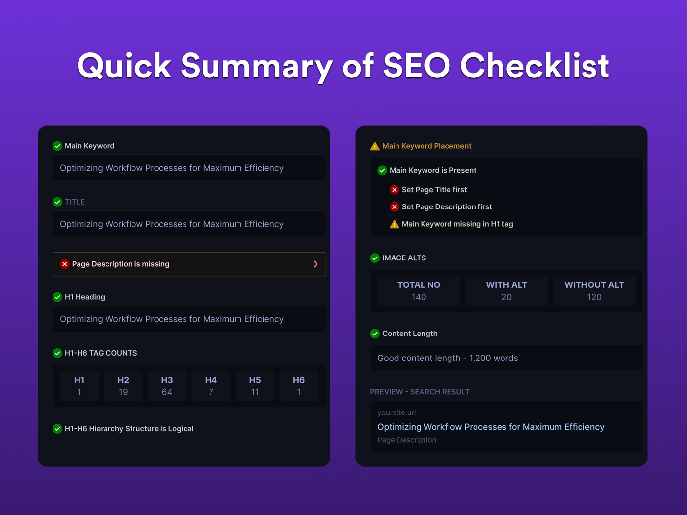

# First Rank Pro

On-page SEO auditing for Framer sites. First Rank Pro analyzes the published pages of your project and checks the fundamentals search engines care about: page title, meta description, H1 and heading hierarchy, main-keyword usage and placement, image alt text, and content length — with a quick summary, per-check guidance, and a live SERP preview.

**By:** @arun-dev-des



The plugin is live on the Framer Marketplace: [**First Rank Pro**](https://www.framer.com/marketplace/plugins/first-rank-pro/) (plugin id `117943`). Marketplace versions are published manually by the author.

## How it works

- Pages and publish state come from the Plugin API (`getPublishInfo`, `subscribeToPublishInfo`, `getNodesWithType("WebPageNode")`), so the audited domain updates live when the site is republished. When a project has both a custom domain and a `*.framer.app` domain, a switcher in the navbar selects which one to audit.
- Page HTML is fetched through Framer's own CORS proxy (`framer-cors-proxy.framer-team.workers.dev`, the same worker other plugins in this repo use) and analyzed client-side. Override it with any transparent CORS-proxy prefix (the target URL is appended raw) via the `VITE_PROXY_URL` environment variable:

    ```bash
    VITE_PROXY_URL="https://your-proxy.example.com/?" yarn dev --filter=first-rank-pro
    ```

- Image alt text can be edited inline; updates are written back to canvas nodes via `setAttributes` with cloned `ImageAsset`s.
- Focus keywords and analysis summaries persist via `setPluginData`/`getPluginData`.
- AI generation surfaces (suggested titles, descriptions, H1s, keywords, and alt text) exist in the code base but are disabled behind a single flag (`src/config/featureFlags.ts`, `AI_GENERATION_ENABLED = false`); the endpoints are env-overridable (`VITE_AI_API_URL`, `VITE_ALT_TEXT_API_URL`).
- The plugin intentionally does not import `framer-plugin/framer.css`; it ships its own design system that themes light/dark off the `data-framer-theme` attribute Framer sets on `<body>` (WCAG AA contrast in both themes), plus an in-plugin theme toggle.

## Development

```bash
yarn dev --filter=first-rank-pro
```

Then open the printed `https://localhost` URL in Framer via **Plugins → Developer Tools → Open Development Plugin**.
