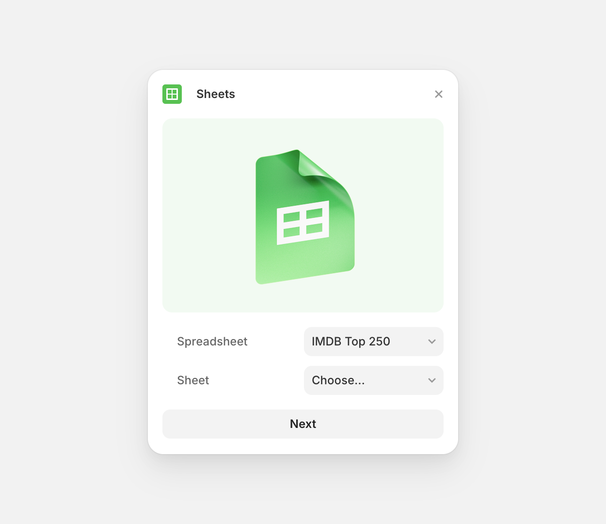

# Framer Google Sheets Plugin

Framer Google Sheets Sync Plugin

**By:** @sakib25800 and @benjamindenboer



## Development

To use a local OAuth worker during development, set the `VITE_LOCAL` environment variable:

```bash
VITE_LOCAL=true yarn dev
```

**Note:** The backend OAuth workers are not open source. The `VITE_LOCAL` flag is only applicable for Framer employees who have access to the local worker infrastructure.
